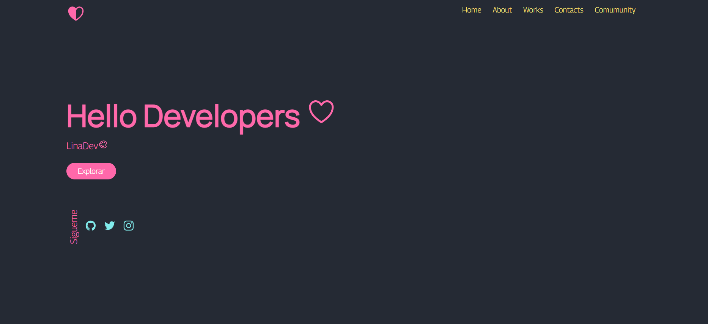
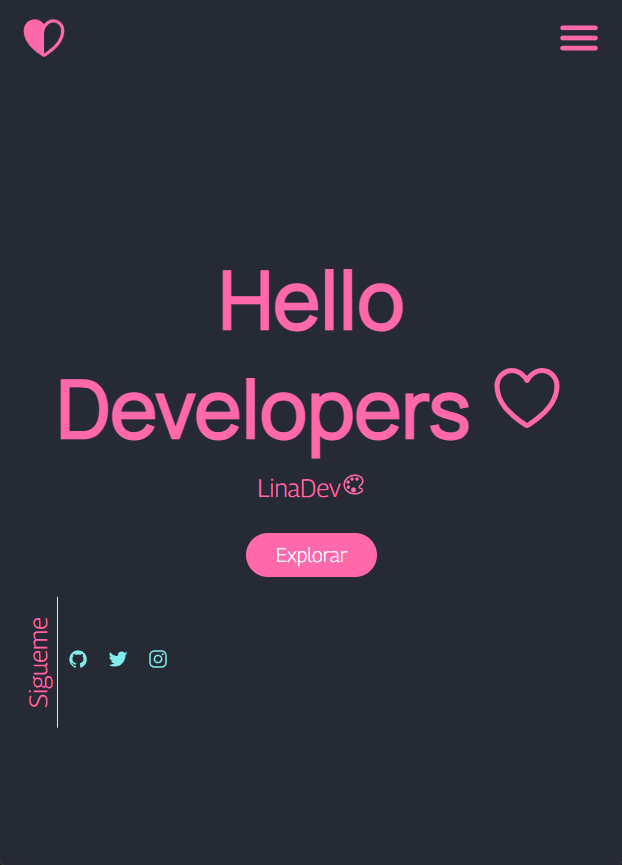
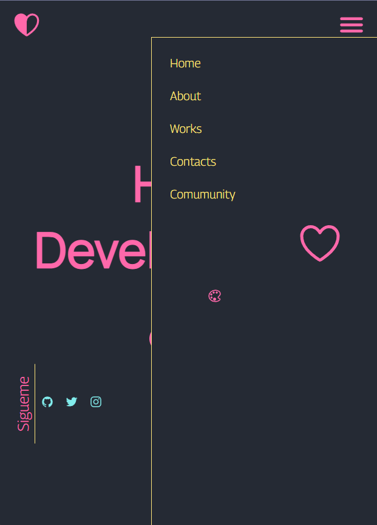
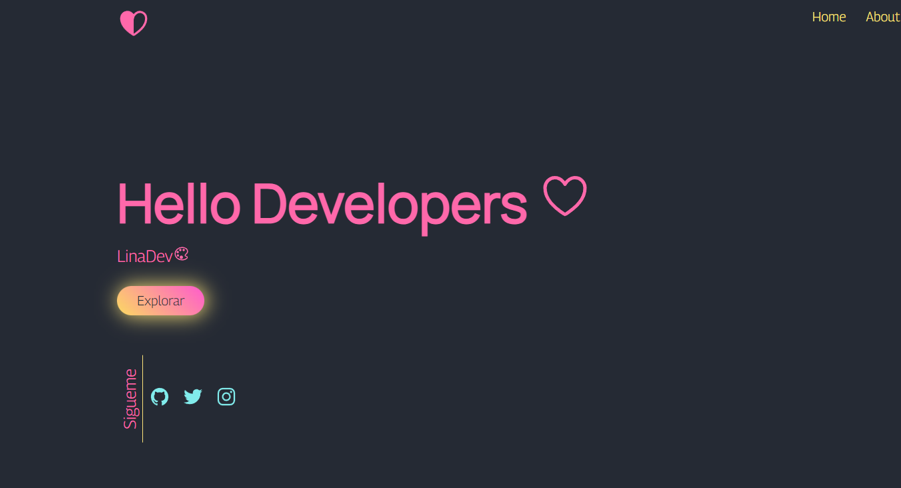

Esta prueba técnica está diseñada para simular una entrevista tecnica real con las alumnas del bootcamp de desarollo de laboratoria.

---
# Prueba técnica 💻

- ## Lenguajes de programación

| Rank | Languages |
|-----:|-----------|
|     1| Javascript|
|     2| HTML      |
|     3| CSS       |

## Carpetas del repositorio

* ## maquetar
- ### ¿Qué debes hacer?

      paso 1: Encontrarás una capeta llamada maquetar en las que se encuentran las siguientes carpetas:
            * css 
            * img

      paso 2: La misión es maquetar la landing page lo mas similar posible.

_nota_: Puedes usar los recursos que sean necesarios para lograr la mayor similitud a la página. 

{width=width height=height}

{width=width height=height}

{width=width height=height}

{width=width height=height}

* ### pruebas_js

La prueba está compuesta por tres ejercicios de logica en Javascript. Todas las preguntas estan enfocadas en evaluar los conocimientos en arreglos, el uso de metodos y funciones.

_nota_: Puedes usar los recursos que sean necesarios para resolver los ejercicios.

### Instrucciones para el envio del respositorio:

- Clonar el repositorio
- Una vez resulta la prueba, subir el repositorio con los cambios a tu cuenta de github.
- Enviar un correo con la siguente información:

      Asunto: Prueba técnica

      nombre:
      fecha:
      link del repositorio:

## Autora ✒️
* **Lina Maria Guerrero** - *Prueba técnica JS* - [linadev14](https://github.com/LinaDev14)

